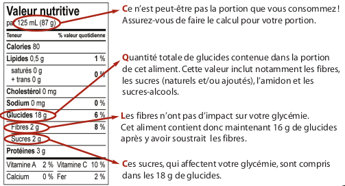

> Dans cette page
* [Méthode](#méthode)
* [Recettes fréquentes](#recettes-fréquentes)
* [Recettes génériques](#recettes-génériques)

Le facteur glycémique d'une recette consiste à calculer la quantité totale de sucre de chaque ingrédient consistant le plat cuisiné et d'identifier le facteur de sucre dans un gramme de la recette terminée.

Cette méthode est pratique pour ne pas avoir à recalculer sans arrêt la quantité de sucre dans un repas, surtout s'il s'agit d'une recette fréquemment cuisinée.

Néanmoins, les ingrédients qui composeront chaque assiette doivent être calculée pour chaque repas et le facteur glycémique approximatif dépend aussi de votre consistance à refaire la recette.

Par exemple, si vous changez la quantité d'un ingrédient quand vous cuisinez une recette pour laquelle vous aviez calculé le facteur glycémique, il est possible que le facteur ne soit plus aussi précis et vous devriez sans doute en tenir compte si vous avez largement dévié de la recette.

## Méthode

À la base, la méthode est relativement simple:

* Il faut calculer la quantité totale de sucre dans chaque ingrédient utilisé et diviser par le poids total de la recette produite.

**Mais comment calculer la quantité totale de sucre dans la recette?**

Le guide offert sur Diabète Québec permet de bien comprendre les nuances qui existent dans le calcul des glucides:
[Calcul des glucides avancé](https://www.diabete.qc.ca/fr/comprendre-le-diabete/ressources/getdocumentutile/Calcul-glucides-nun-10g.pdf)

----
Par exemple, pour l'ingrédient fictif ici-bas, on peut identifier les informations suivantes:

Source: Calcul des glucides avancé, Diabète Québec

Pour une quantité de 87 g, on retrouve 18 g de glucides, dont 2 g de fibres.

Au total, il y a donc 16 g de glucides qui ont une incidence sur la glycémie d'un diabétique.

Le facteur glycémique est donc 16 g / 87 g:

> 0,183908046 (on peut arrondir ici et utiliser 0,1839)

Pour savoir combien de sucre il y a dans la portion utilisée dans la recette, on multiplie le poids de l'ingrédient dans par le facteur.

Par exemple, si on avait 200 g de l'ingrédient fictif ici-haut, la quantité de sucre serait de 200 g * 0,1839, soit **36,7816 g de sucre**.

----

Lorsque les ingrédients ne contiennent que les valeurs en millilitre ou en tasse à mesurer, il faut faire un peu plus de calculs mais le principe reste le même.

Lorsqu'on a la quantité individuelle de chaque ingrédient, on additionne le tout pour connaître la quantité totale de sucre dans l'ensemble de la recette.

On cuisine alors le tout et on pèse la recette dans son intégralité.

>Il ne faut pas inclure le poids du contenant dans lequel on pèse la recette, ça fausserait les résultats!

Finalement, on divise la quantité totale de sucre par le poids total de la recette et on obtient le facteur glycémique approximatif pour la recette!

>On peut aussi suivre cette étape d'un bon verre de vin, on l'a bien mérité...

Pas étonnant qu'on ne veuille pas faire l'exercice à chaque fois et c'est également pourquoi j'ai décidé de lister ici les facteurs glycémiques approximatifs des recettes que nous faisons souvent.

## Recettes fréquentes

Voici une liste de recettes que nous faisons fréquemment à la maison avec le calcul approximatif de l'indice glycémique.

>**Attention**: Les facteurs glycémiques ici-bas sont approximatifs et peuvent varier en fonction des quantités utilisées pour les recettes. Ils sont donc offerts sans garanties d'exactitude.

| Recette | Facteur Glycémique Approximatif | Auteur* |Source | Notes |
|---|:---:|:---|:---|:---|
|Mijoté de boeuf à la bière|0,069|Ricardo Larrivée|[Page Web](https://www.ricardocuisine.com/recettes/5056-mijote-de-boeuf-a-la-biere)|Il s'agit d'une recette relativement simple à faire et que les enfants aiment beaucoup!|
|Poulet à l'ananas à la mijoteuse|0,07|Ricardo Larrivée|[Page Web](https://www.ricardocuisine.com/recettes/5609-poulet-a-l-ananas-a-la-mijoteuse)|Recette assez rapide à préparer avec cuisson à la mijoteuse.|
|Pâté chinois réinventé|0,1031|Geneviève O’Gleman|[Page Web](http://cuisinefuteeparentspresses.telequebec.tv/recettes/22/pate-chinois-reinvente)|Recette intéressante et pouvant être congelée.|
|Tofu épicé sauce aux arachides|0,08|Jean-Philippe Cyr|[Page Web](https://www.lacuisinedejeanphilippe.com/recipe/tofu-epice-sauce-aux-arachides/)|Recette facile et rapide. Les épices sont optionnels|

*Auteur présumé

## Recettes génériques

Les recettes listées ici-bas sont tirées des guides listés dans les diverses pages (références à venir).
Il s'agit de recettes génériques (ex.: boeuf en sauce) permettant une approximation du facteur glymique afin de sauver du temps.
À force de calculer les différentes recettes, on peut s'apercevoir que les facteurs listés ici sont en effet assez proches de la réalité.

(Tableau à venir)
